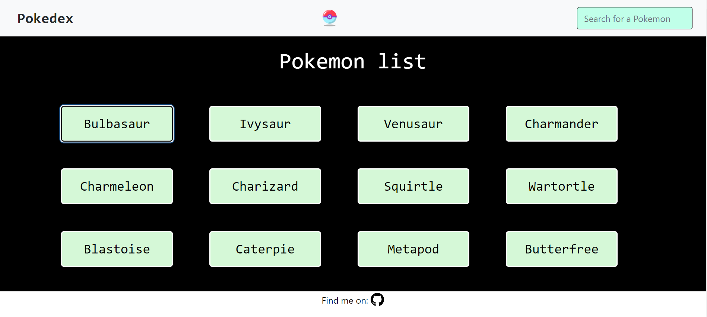

This is a simple web application built with HTML, CSS, and JavaScript that allows users to search for and view information about different Pokemon. The app uses the PokeAPI to retrieve data about Pokemon.

General Information:
The Pokedex App is a tool designed for Pokemon fans who want to quickly look up information about their favorite Pokemon. The app features a user-friendly interface that makes it easy to search for Pokemon by name. Users can also click on a Pokemon to view more detailed information about it.

Usage:
To search for a Pokemon, simply type its name into the search bar at the top of the page. The app will display a list of all Pokemon that match your search term. Click on a Pokemon to view more detailed information about it, including its name and type/s. 

Tools and Languages Used:
The Pokedex App was built using the following tools and languages:

HTML,
CSS,
JavaScript,
Bootstrap,
jQuery,
Fetch API.

